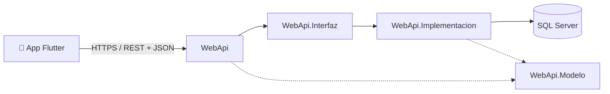

<div align="center">

# 🌱 Eco-Retos

**Gamifica el hábito ecológico: retos ambientales, un jardín virtual que crece contigo y comunidad estudiantil.**

Proyecto desarrollado para el **Concurso Multidisciplinario de Aplicaciones Móviles Creativas**
del **Centro Universitario Regional de Carazo (CUR-Carazo) — UNAN Managua**.

[](https://flutter.dev)
[](https://dart.dev)
[](https://dotnet.microsoft.com)
[](https://learn.microsoft.com/aspnet/core)
[](https://www.microsoft.com/sql-server)
[](#-licencia)
[](#-roadmap)

</div>

---

## 📖 Sobre el proyecto

**Eco-Retos** es una aplicación móvil que busca fomentar hábitos sostenibles en la comunidad
universitaria a través de la **gamificación**: los usuarios completan retos ecológicos del día a día
(ahorro de agua y energía, reciclaje, movilidad sostenible, entre otros), acumulan puntos y suben
de nivel mientras ven crecer un **jardín virtual** que refleja su progreso real.

El proyecto nace a partir de un **prototipo web funcional** (autenticación, panel administrativo,
muro de la comunidad, sistema de retos, trivias y colecciones) que sirvió como prueba de concepto de
la experiencia de usuario, y evoluciona hacia una **aplicación móvil multiplataforma** con un backend
propio, pensada para el evento de innovación de aplicaciones móviles de la universidad.

### ✨ Funcionalidades clave

| Módulo | Descripción |
|---|---|
| 🔐 **Autenticación** | Registro e inicio de sesión de usuarios |
| 🌿 **Jardín virtual** | Representación visual del progreso del usuario; crece al completar retos |
| 🎯 **Retos ecológicos** | Catálogo de desafíos sostenibles con recompensas en puntos |
| 🧠 **Trivias** | Preguntas educativas sobre medio ambiente y sostenibilidad |
| 🏅 **Colección** | Insignias/logros desbloqueables por desempeño |
| 📣 **Muro comunitario** | Feed social para compartir avances con otros usuarios |
| 🛠️ **Panel administrativo** | Gestión de retos, trivias, colecciones y usuarios |

---

## 🏗️ Arquitectura

Monorepo dividido en dos grandes componentes que se comunican vía **API REST**:

```
Eco-Retos/
├── Movil/      → App cliente en Flutter (Android, iOS, Web, Desktop)
└── Backend/    → API REST en ASP.NET Core, en arquitectura por capas
```

### Backend — arquitectura en capas

```
Backend/
├── WebApi/                      # Capa de presentación: Controllers, configuración, Swagger
├── WebApi.Modelo/                # Entidades y modelos de dominio
└── Services/
    ├── WebApi.Interfaz/          # Contratos de los servicios de negocio
    └── WebApi.Implementacion/    # Implementación de la lógica de negocio
```

Este diseño separa responsabilidades (presentación · dominio · lógica de negocio) para facilitar
pruebas, mantenimiento y el trabajo en paralelo entre miembros del equipo.



---

## 🧰 Stack tecnológico

**Frontend móvil**
- [Flutter](https://flutter.dev) / Dart — multiplataforma (Android, iOS, Web, Windows, macOS, Linux)

**Backend**
- [ASP.NET Core](https://learn.microsoft.com/aspnet/core) (C#) — API REST
- Arquitectura en capas (WebApi · Interfaz · Implementación · Modelo)
- Swagger / OpenAPI para documentación de endpoints

**Base de datos**
- Microsoft **SQL Server**

**Herramientas**
- Git / GitHub — control de versiones y colaboración
- Visual Studio / VS Code — entornos de desarrollo

---

## 📂 Estructura del repositorio

```
Eco-Retos/
├── Backend/
│   ├── eco_reto.sln
│   ├── WebApi/
│   ├── WebApi.Modelo/
│   └── Services/
│       ├── WebApi.Interfaz/
│       └── WebApi.Implementacion/
├── Movil/
│   ├── lib/
│   ├── android/
│   ├── ios/
│   └── ...
├── .gitignore
└── README.md
```

---

## 🚀 Puesta en marcha

### Requisitos previos

- [.NET SDK 8+](https://dotnet.microsoft.com/download)
- [Flutter SDK](https://docs.flutter.dev/get-started/install) 3.9+
- [SQL Server](https://www.microsoft.com/sql-server) (local o remoto) / SQL Server Management Studio
- Git

### Backend (ASP.NET Core)

```bash
cd Backend
dotnet restore
dotnet build
dotnet run --project WebApi
```

La API quedará disponible en `https://localhost:{puerto}` con Swagger UI en `/swagger`.

> Configura la cadena de conexión a SQL Server en `WebApi/appsettings.json` antes de ejecutar.

### App móvil (Flutter)

```bash
cd Movil
flutter pub get
flutter run
```

---

## 👥 Equipo

| Integrante | Rol |
|---|---|
| Arnold120 | Desarrollo |
| Franciscosanchezavellan514 | Desarrollo |

*Proyecto multidisciplinario desarrollado por estudiantes de CUR-Carazo, UNAN Managua.*

---

## 🗺️ Roadmap

- [x] Estructura inicial del monorepo (Backend + Movil)
- [x] Base de datos `eco_retos` conectada al backend
- [ ] Endpoints de autenticación (registro / login)
- [ ] Módulo de retos ecológicos (CRUD + asignación de puntos)
- [ ] Jardín virtual (lógica de niveles y crecimiento)
- [ ] Módulo de trivias
- [ ] Sistema de colección / insignias
- [ ] Muro comunitario
- [ ] Panel administrativo
- [ ] Integración completa Flutter ↔ API
- [ ] Empaquetado y demo para el evento

---

## 📄 Licencia

Proyecto académico desarrollado con fines educativos para el Concurso Multidisciplinario de
Aplicaciones Móviles Creativas de CUR-Carazo, UNAN Managua.
